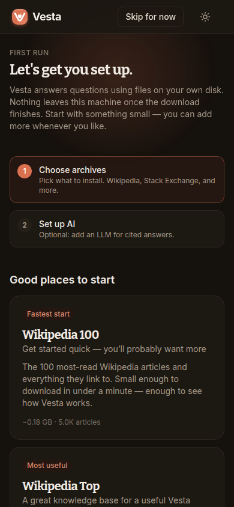
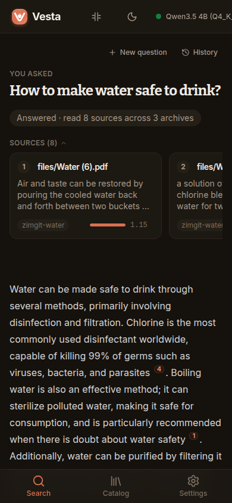
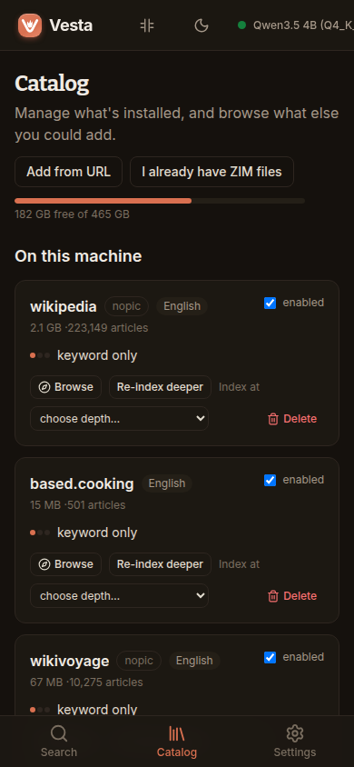

# Vesta

**A private, offline library you can ask questions.**

Vesta turns Kiwix ZIM archives (Wikipedia, StackExchange, Project Gutenberg,
Wikivoyage, and thousands more) into a knowledge base you search and converse
with. Ask a question in plain language and get a direct answer, with every claim
cited back to the passage it came from. It all runs on your machine: after setup,
no internet connection is needed.

<p align="center">
  
  
  
</p>

## Highlights

- **Ask, don't dig.** Get a direct answer instead of a list of links.
- **Answers you can verify.** Every claim carries a citation to the exact
  source passage. Click through and check it yourself.
- **Truly offline.** Once set up, Vesta
  works air-gapped and nothing ever leaves your machine.
- **Your hardware.** Run the language model locally on CPU or GPU,
  or point Vesta at any OpenAI-compatible endpoint you already have.
- **One container.** App, models, and model runtime ship as a
  single Docker image with a guided first-run setup.

## Quick start

The fastest way in is Docker. You can run the container image directly with `docker run` or use Docker Compose.

### Docker Run

```bash
docker run -d \
  --name vesta \
  -p 5129:8080 \
  -v $(pwd)/data:/app/data \
  --restart unless-stopped \
  ghcr.io/cubicalbatch/vesta:latest
```

> **GPU acceleration (optional):** To enable Intel or AMD GPU acceleration via Vulkan, pass `--device /dev/dri:/dev/dri`.

### Docker Compose

```bash
docker compose up -d
```

> If building locally from source rather than pulling the pre-built image, run `docker compose up -d --build`.

Then open **http://localhost:5129**. On first run, a setup wizard walks you
through downloading an archive and a model, from there everything happens in
the UI.

All persistent data (archives, models, database) lives in a single directory
mounted from the host (`./data`), so backing up or moving Vesta is a file copy.

### Without Docker

You'll need Linux or macOS, Python 3.13+ with [uv](https://docs.astral.sh/uv/),
and Node 20+ to build the UI.

```bash
git clone https://github.com/cubicalbatch/vesta.git
cd vesta
uv sync                                  # Python dependencies
uv run vesta models                      # search models
cd frontend && npm ci && npm run build && cd ..   # build the UI
./start.sh                               # serve on http://localhost:5586
```

## Building your library

Two ways to add archives:

- **In the app**: browse the built-in Kiwix catalog and download whatever you
  want.
- **By hand**: drop `.zim` files into `data/zims/`; Vesta picks them up
  automatically.

Semantic search needs a one-time index build per archive: from the web UI,
or:

```bash
uv run vesta index              # all archives
uv run vesta index --depth 3    # highest answer quality
```

Index depth is a speed/quality dial: 1 builds fastest, 3 gives the best
answers but takes a lot to build.

## Choosing a model

Switchable at any time in Settings:

- **Local (default)**: drop a GGUF file into `data/models/` or download one
  in the UI. By default, Vesta uses **Qwen 3.5 4B**, which requires ~4GB of memory when loaded. If your computer doesn't have a GPU, answers can take 2–3 minutes to generate. Vesta manages the model server for you: it loads on demand, unloads when idle, and uses your GPU when one is available.
- **Remote**: point Vesta at any OpenAI-compatible endpoint (Ollama, vLLM,
  OpenRouter, …).

## Configuration

Nearly everything is a setting in the web UI, and nearly everything applies
without restarts.

## Acknowledgements

Vesta relies on great work from others:

- [Kiwix](https://www.kiwix.org), who create and maintain the ZIM archives
  that make offline Wikipedia, StackExchange, Project Gutenberg, and thousands
  more possible.
- [llama.cpp](https://github.com/ggml-org/llama.cpp), whose `llama-server`
  binary we bundle to run the local language model.
- [ONNX Runtime](https://onnxruntime.ai), which powers the embedding and
  reranking encoders.
- The authors of the bundled encoder models:
  [potion-retrieval-32M](https://huggingface.co/minishlab/potion-retrieval-32M)
  by minishlab,
  [granite-embedding-small-english-r2-ONNX](https://huggingface.co/onnx-community/granite-embedding-small-english-r2-ONNX)
  by IBM, and
  [ms-marco-MiniLM-L-6-v2](https://huggingface.co/Xenova/ms-marco-MiniLM-L-6-v2).

## License

Apache 2.0
